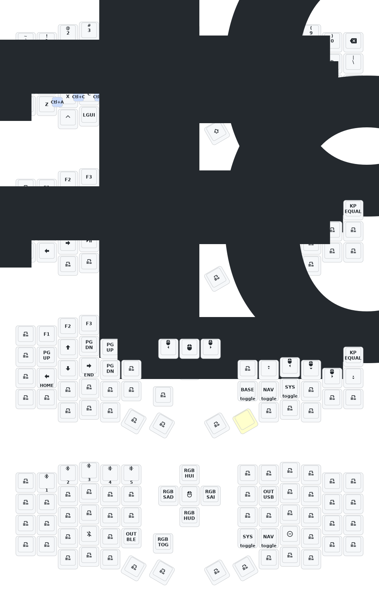
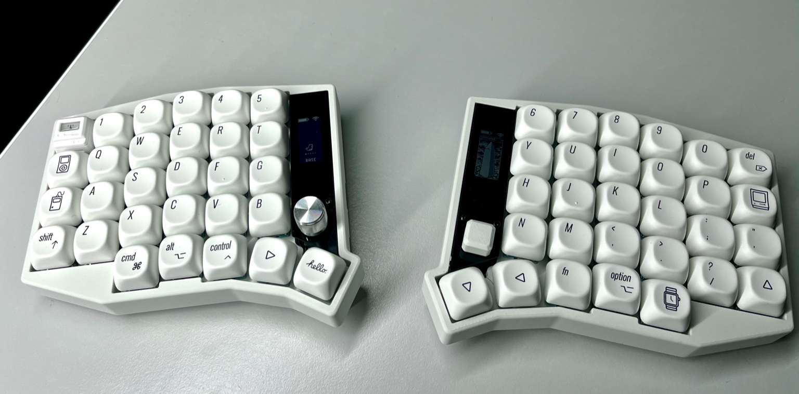
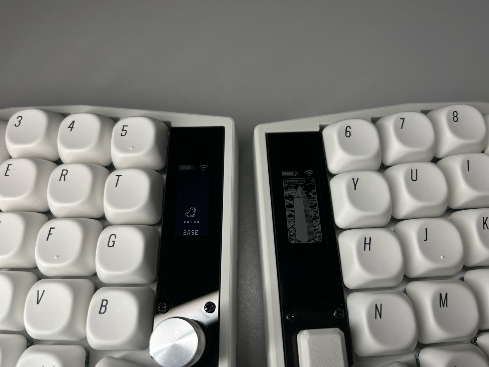

# 3C Sofle "Eyelash" Firmware (ZMK)
This is a heavily modified fork of [`a741725193/zmk-sofle`](https://github.com/a741725193/zmk-sofle), adapted for a custom Sofle-style split keyboard purchased from the same user, likely featuring clone Nice!Nano + Nice!View hardware. These boards are sold on AliExpress under the brand "3C".

## 🛠️ Hardware Setup
- **Keyboard**: Sofle-style split keyboard (3C AliExpress edition)  
- **Controllers**: Nice!Nano v2 (x2)
- **Displays**: Nice!View (e-paper) on both halves (possibly clones)
- **Encoders**:
  - Left half: Rotary encoder (EC11 style)
  - Right half: 5-way hat switch
- **Lighting**: WS2812 RGB per-key LEDs underglow.
- **Other**: 2000mAh battery

## 🪰 Firmware Details
- **Base**: [ZMK Firmware](https://zmk.dev)
- **Forked from**: [`a741725193/zmk-sofle`](https://github.com/a741725193/zmk-sofle)
- **Notable Changes**:
  - Cleaned and restructured keymap using [urob/zmk-helpers](https://github.com/urob/zmk-helpers)
  - Using [urob’s Timeless HRM](https://github.com/urob/zmk-helpers#timeless-home-row-mods) implementation for balanced hold-taps
  - Encoder support (volume, RGB control)
  - Mouse key movement + scroll support (copied from urob)
  - Hammerbeam-style slideshow on the right display (from [GPEye](https://github.com/GPeye/hammerbeam-slideshow))
  - Custom Luna animation on the left display, featuring original battery and connectivity symbols. Heavily modified from [mctechnology17](https://github.com/mctechnology17/zmk-nice-oled))
  - Untested Studio support (Works in the original Chinese fw)

## 📺 Display Configuration
This setup uses custom display logic:

- **Left Display** (Nice!View):
  - Battery icon, Bluetooth status, Layer name, Luna animation
  - Removed typing activity/WPM graph, but Luna still supports key states and wpm
- **Right Display** (Nice!View):
  - Previously showed Mario animation from GPEye. Some of these AliExpress Sofle's come with the Urchin animation, some with Mario.

## 📌 Acknowledgements
- Original firmware from [`a741725193`](https://github.com/a741725193/zmk-sofle)
- Helper modules from [urob](https://github.com/urob/zmk-helpers)
- ZMK community for documentation and modules

## 🖼️ Images
Current layout:

Sofle AliExpress keeb, GMK+ Mac Minimalist MA keycaps (AliExpress clones), TTC Bluish White Silent switches:

Screens:
